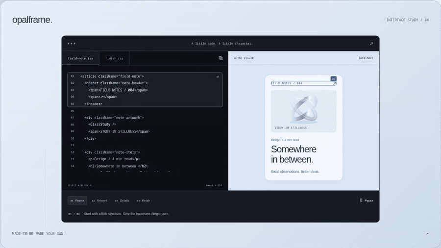
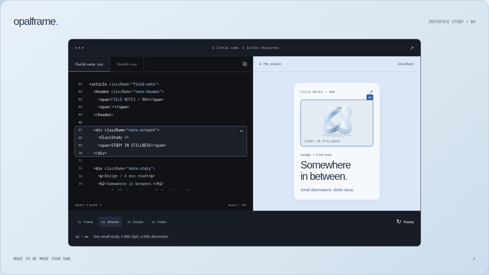
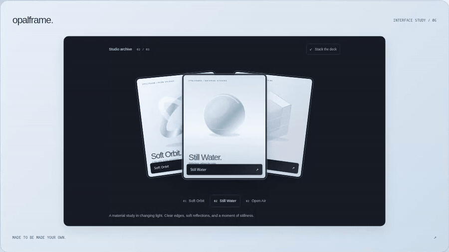
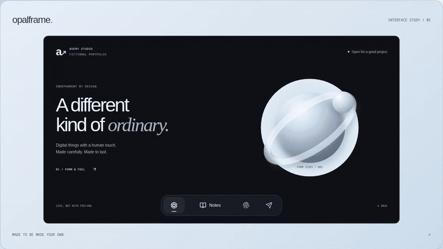
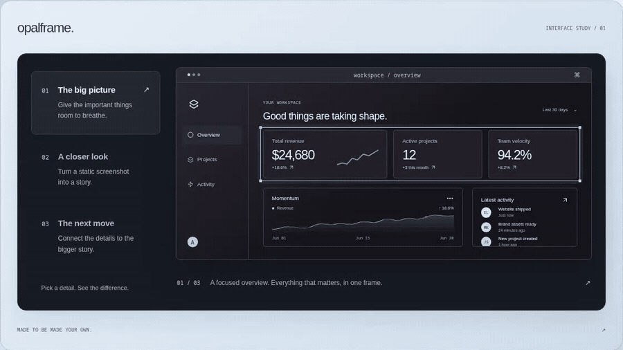
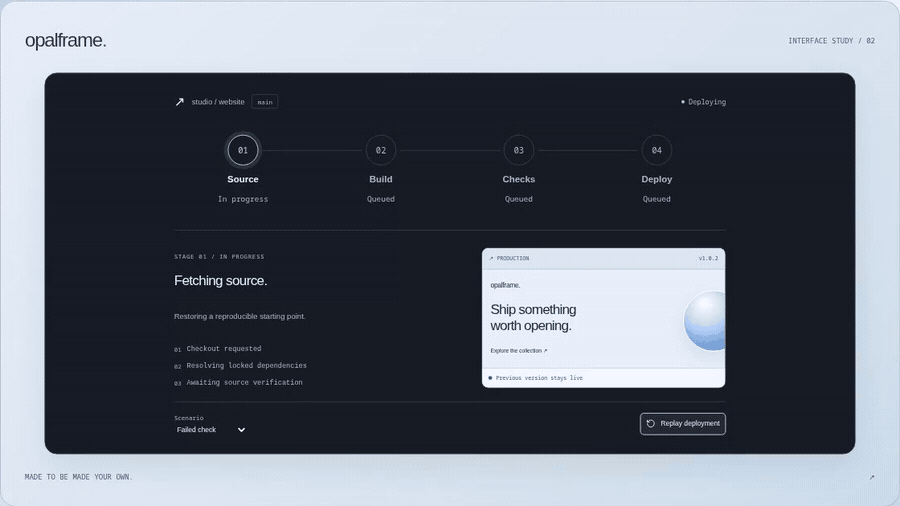
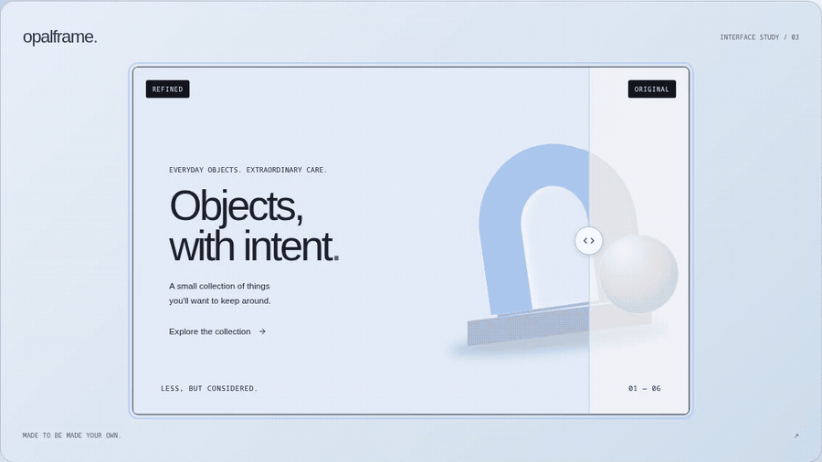
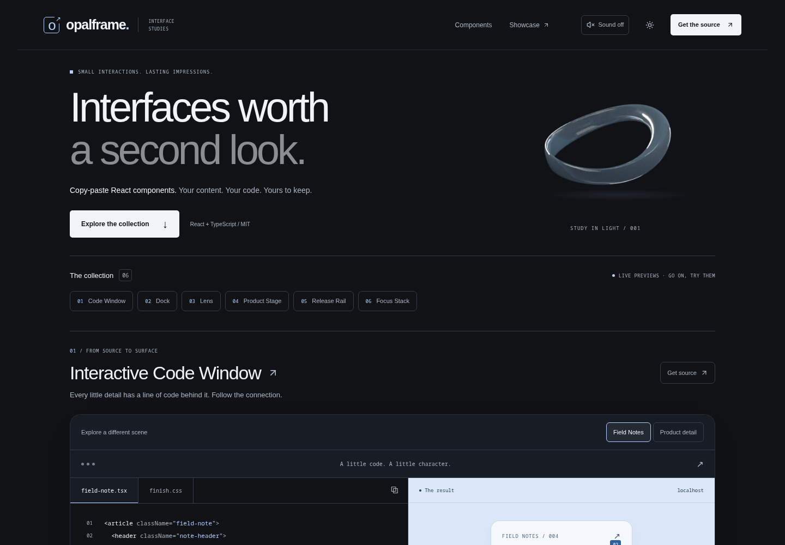

# opalframe.

**Six carefully made React interactions. Copy the source. Make them yours.**



[Live demo](https://aduneer.github.io/opalframe/) · [GitHub](https://github.com/Aduneer/opalframe) · [Components](#components) · [Quickstart](#quickstart) · [Recordings](artifacts/clips/README.md) · [Contributing](CONTRIBUTING.md) · [MIT](LICENSE)

Source you own, useful props, and scoped CSS. React is the only component runtime dependency. Explore live previews, copy individual files, or install through the official shadcn registry.

Explore the [live collection](https://aduneer.github.io/opalframe/), or run it locally with the quickstart below.

## Components

| Interactive Code Window                                                                                                                                             | Focus Stack                                                                                                                                                          |
| ------------------------------------------------------------------------------------------------------------------------------------------------------------------- | -------------------------------------------------------------------------------------------------------------------------------------------------------------------- |
|                                                                                 |                                                                         |
| Select a code block. Follow the detail it makes. [Source](packages/components/interactive-code-window.tsx) · [CSS](packages/components/interactive-code-window.css) | Spread your image collection, select a work, and keep its story in focus. [Source](packages/components/focus-stack.tsx) · [CSS](packages/components/focus-stack.css) |

| Expandable Dock                                                                                                                                                                                                            | Product Stage                                                                                                                                                       |
| -------------------------------------------------------------------------------------------------------------------------------------------------------------------------------------------------------------------------- | ------------------------------------------------------------------------------------------------------------------------------------------------------------------- |
|                                                                                                                   |                                                                                   |
| Labels expand on hover or focus; a measured marker tracks the current destination. Your icons, native links or actions. [Source](packages/components/expandable-dock.tsx) · [CSS](packages/components/expandable-dock.css) | Guide visitors through a product preview with measured focus frames. [Source](packages/components/product-stage.tsx) · [CSS](packages/components/product-stage.css) |

| Release Rail                                                                                                                                          | Comparison Lens                                                                                                                                                         |
| ----------------------------------------------------------------------------------------------------------------------------------------------------- | ----------------------------------------------------------------------------------------------------------------------------------------------------------------------- |
|                                                                    |                                                                |
| Inspect release stages, failures, and what remains live. [Source](packages/components/release-rail.tsx) · [CSS](packages/components/release-rail.css) | Reveal aligned before/after layers with pointer, touch, or keyboard. [Source](packages/components/comparison-lens.tsx) · [CSS](packages/components/comparison-lens.css) |

## Quickstart

Use Node.js 22 or newer and npm. Clone or download this repository, then run:

```sh
npm ci
npm run dev
```

Open [localhost:3000](http://localhost:3000). Each component page includes an interactive preview, installation command, usage, props, customization, accessibility notes, and both source files.

Open **Customize** in a preview to try accents, widths, and Soft/Square finishes. Accents tint selected surfaces as well as interaction markers. Copy the generated CSS and add the shown `className` to your component; **Reset styles** restores the original appearance.

### Install with shadcn

Run this from your own React project with shadcn configured:

```sh
npx shadcn@latest add https://aduneer.github.io/opalframe/r/comparison-lens.json
```

The installer copies `comparison-lens.tsx` and `comparison-lens.css` into your UI directory. For another component, replace `comparison-lens` with `interactive-code-window`, `expandable-dock`, `product-stage`, `release-rail`, or `focus-stack`.

When developing the registry locally, use the running local site instead:

```sh
npx shadcn@latest add http://localhost:3000/r/comparison-lens.json
```

The docs Installation buttons include the repository path automatically.

### Copy the files yourself

Copy a component's `.tsx` and `.css` files from [packages/components](packages/components) into the same directory in your project. Keep the component's CSS import. The components use React and browser APIs; they do not import the docs app, Next.js, Tailwind, or an animation library. Tailwind utilities are optional through `className`.

For example, after copying Comparison Lens beside this file:

```tsx
import { ComparisonLens } from "./comparison-lens";

export default function Example() {
  return (
    <ComparisonLens
      before={<div style={{ padding: 32 }}>The starting point.</div>}
      after={<div style={{ padding: 32 }}>A little more considered.</div>}
      beforeLabel="Original"
      afterLabel="Refined"
      defaultValue={58}
    />
  );
}
```

In a React Server Components app, render interactive callbacks and controlled state from a client component. The copied studies already declare their client boundary.

### Compatibility

The collection is developed and checked with React 19 and TypeScript. Automated
interaction and accessibility checks run in Chromium at desktop and mobile
viewport sizes; physical-device, Safari, and Firefox review remains open. Older
React versions have not been verified.

Use a browser with native `ResizeObserver`, `IntersectionObserver`, and CSS
custom-property support. Keep each stylesheet beside its component. Your app
supplies the content, images, icons, and any backend integration; no Opalframe
service is required. Set image dimensions or an aspect ratio to preserve layout
while images load.

The docs site uses Next.js and Tailwind; copied components require neither.
Component-specific keyboard behavior and reduced-motion details are documented
alongside each live example.

## A little atmosphere



The homepage opens through a beveled studio window: scrolling clears the glass before handing off to the collection. **Enter studio** skips the opening; reduced motion and direct section links bypass it.

The gallery pairs Pearl and Charcoal materials with an original Blender glass ribbon. Its native video preserves the transparent background throughout the rotation, with a still fallback when alpha video is unsupported. Motion is pausable, respects reduced motion, and stops when the artwork is hidden, off-screen, or unfocused. Optional ambient sound starts off and loads only after activation.

Brief glass ripples acknowledge clicks, taps, and keyboard activation within the gallery. They respect reduced motion and leave the native controls in charge.

All portfolio, journal, product, and release examples are fictional. Avery is the sample portfolio persona, not the project author. The homepage offers optional finite stories for Product Stage and Release Rail; choosing a control takes over immediately.

Artwork, the scrolling opening, pointer feedback, and music belong to the docs site; copying a component brings only its interaction and stylesheet. Release Rail's demo is a simulation; supply your own release state in production.

## Record something worth sharing

Open the local [recording studio](http://localhost:3000/showcase?component=interactive-code-window). Choose 16:9, 1:1, or 9:16, a Charcoal/Pearl/Aero backdrop, and an independent demo theme. Hide the controls; Escape or the touch reveal button restores them. Recording mode stays silent.

The homepage, docs, and recording mode offer alternate examples: Studio or Travel journal for the Dock, and Field Notes or Product detail for Code Window. The Example selector changes content, icons, snippets, and focus targets while using the same reusable components. Opening recording mode from a docs preview carries its selected example.

[Real eight-second clips](artifacts/clips/README.md) include MP4, GIF, and poster exports from the browser demos. [Watch the portrait code walkthrough](artifacts/clips/interactive-code-window-9x16.mp4).

<details>
<summary>Reproduce screenshots and clips</summary>

With the site running and Playwright Chromium installed:

```sh
npx playwright install chromium
npm run capture
npm run capture:presentation
npm run record:launch
npm run record -- --component interactive-code-window --ratio 9/16
npm run record -- --component expandable-dock --preset alternate --ratio 9/16
```

Recording requires `ffmpeg` and `ffprobe` on PATH. `--ratio` accepts `16/9`, `1/1`, or `9/16`; `--component` accepts any study slug or `all`. Set `PLAYWRIGHT_CHROMIUM_EXECUTABLE_PATH` for an existing Chromium browser, or `PREVIEW_URL` for another local address. Finished assets are committed; raw intermediates are ignored.

`npm run record:launch` refreshes all six landscape studies, square/portrait Code Window, Dock and Focus Stack, landscape/portrait alternate examples, and both-theme studio-opening/artwork clips.

Use `--preset alternate` with `expandable-dock` or `interactive-code-window` to record their second examples. Alternate exports include `-alternate` in the filename, preserving the original clips.

Original [Blender artwork](scripts/artwork/README.md) and [audio](scripts/audio/README.md) have separate reproducible sources and export instructions.

</details>

## Contribute

Bug fixes, clearer examples, accessibility improvements, and useful component proposals are welcome. Start with an interaction that improves a real website and one demo worth recording. [CONTRIBUTING.md](CONTRIBUTING.md) explains setup, checks, and the complete component workflow. Issue and pull-request templates are included.

The [roadmap](ROADMAP.md) keeps the first edition focused on six studies, with future additions chosen for their usefulness and interaction quality.

<details>
<summary>Workspace and checks</summary>

```text
packages/components/    Portable TypeScript and scoped CSS
apps/docs/             Gallery, docs, registry, and recording studio
scripts/               Registry generation, exports, and captures
tests/                Browser interaction and accessibility checks
artifacts/             README hero and indexed demo recordings
```

```sh
npm run registry
npm run typecheck
npm run lint
npm run format:check
npm run build
npm test

# Static GitHub Pages build and browser checks
npm run build:pages
npm run test:pages
```

Registry files are generated before dev/build. Edit component source rather than generated JSON. Browser checks require Playwright Chromium or `PLAYWRIGHT_CHROMIUM_EXECUTABLE_PATH`. See [CONTRIBUTING.md](CONTRIBUTING.md#static-site-preview) for the static-site preview.

</details>

## License

[MIT](LICENSE), including the original artwork and Quiet 01 composition. Keep the license notice when redistributing. [Asset credits and third-party notices](ASSET-CREDITS.md) document the original materials and Lucide icons used by the docs site.
